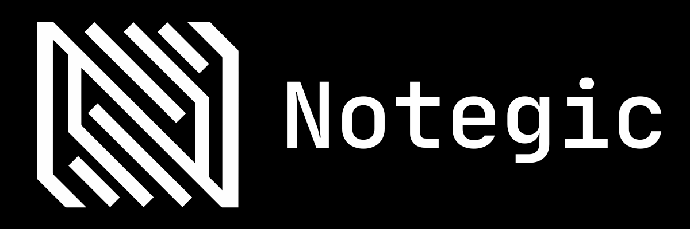

<a></a>

# Notegic Frontend

Notegic is a workspace for turning notes, reference materials, and recurring
work into an organized, connected workflow. This repository contains the
applications that people use to create, manage, and collaborate on that work.

## Highlights

- Organize content into shelves, folders, materials, and block packs.
- Write and share structured documents with live collaboration.
- Plan routines, tasks, dependencies, and their progress.
- Personalize dashboards, preferences, and account settings.
- Manage notifications, connected sign-in methods, and API keys.

## Applications

| Application | Status | Details |
| --- | --- | --- |
| [Web](apps/web/README.md) | Available | Browser experience, local setup, supported features, and Web-specific architecture. |
| Desktop | Planned | Its README will live at `apps/desktop/README.md` when the application is introduced. |
| Mobile | Planned | Its README will live at `apps/mobile/README.md` when the application is introduced. |

## Repository structure

```text
apps/
  web/              Current browser application
  desktop/          Future desktop application boundary
  mobile/           Future mobile application boundary
shared/             Code and contracts shared by applications
docs/               Product, architecture, and operating documentation
test/               Frontend verification
scripts/            Repository tooling
```

For application-specific setup, commands, technical decisions, and folder
structure, start with the relevant README under `apps/`. Shared-code guidance
is available in [shared/README.md](shared/README.md), and the broader
documentation map is in [docs/README.md](docs/README.md).

## License

Proprietary software by Notegic — All rights reserved. Use of this repository
is governed by the [EULA](LICENSE.md) and its [Traditional Chinese version](<LICENSE(tw).md>).
Third-party licenses are listed in [LICENSES/third_party](LICENSES/third_party).

<!-- DEVLOG:START -->
## Development log

This section is automatically maintained from the current change and recent local Git history. Detailed intent belongs in commit messages and design documents.

### Recent snapshots

- [2026-09/2026-09-12](docs/devlogs/2026-09/2026-09-12.md)
- [2026-09/2026-09-11](docs/devlogs/2026-09/2026-09-11.md)
- [2026-09/2026-09-10](docs/devlogs/2026-09/2026-09-10.md)
- [2026-09/2026-09-08](docs/devlogs/2026-09/2026-09-08.md)
- [2026-09/2026-09-07](docs/devlogs/2026-09/2026-09-07.md)
<!-- DEVLOG:END -->
